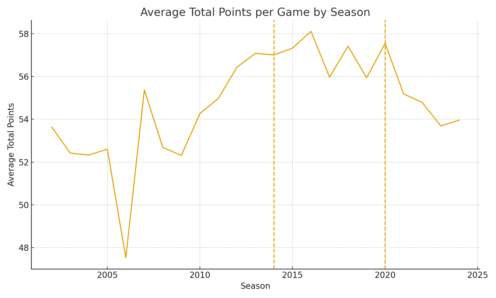
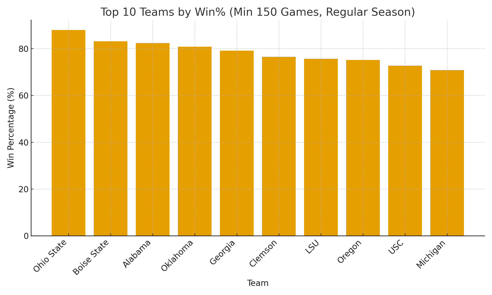

# Are College Football Games Really Getting Wilder? (2002–2024)

Using 20+ seasons of game-level results, I tested whether scoring has climbed and which programs dominated.

---

## 🏈 Scoring Trend

**What to notice:** Average total points per game show a long-run rise, with inflection near the 2014 CFP launch and the 2020 pandemic-shortened season.

---

## 🏆 Dominance Since 2002

**What to notice:** A small set of programs maintain the highest long-run win rates.  
A minimum-games threshold (150 +) keeps rankings fair for active teams.

---

### 📊 Interactive Dashboard
Below is the full Tableau dashboard version — explore filters and KPIs interactively!

  <iframe 
    src="https://public.tableau.com/views/College_dashboard_final/CollegeFootballPerformanceDashboard?:showVizHome=no&:embed=true" 
    width="100%" 
    height="900px" 
    frameborder="0" 
    allowfullscreen="true">
  </iframe>

---

### 📈 Data & Tools
**Data:** Kaggle box scores (2002–2024)  
**Tools:** Tableau (for visuals), Python/pandas (for preprocessing)  
**AI Assistance:** ChatGPT (GPT-5 Thinking) for report structure and markdown formatting.

---

### 🔗 Links
- **GitHub Repo:** [cfb-scores-2002-2024](https://github.com/dalluram2011/cfb-scores-2002-2024)
- **Live Dashboard:** [View on Tableau Public](https://public.tableau.com/app/profile/matthewdallura/viz/NCAAFootballDashboard)

